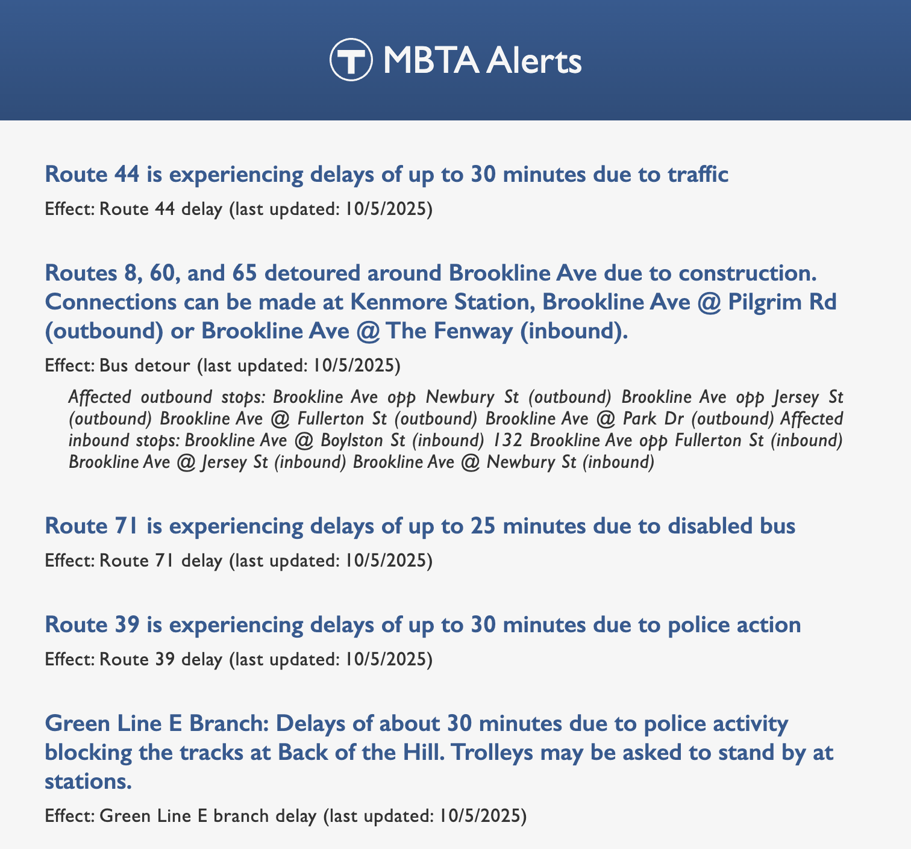

# MBTA Alerts API

> View the MBTA's active alerts for all modes of transit.

> 

## Table of Contents

1. [Tech Stack](#tech-stack)
1. [Development](#development)
   1. [MBTA API](#mbta-api)
   1. [Notes](#notes)

## Tech Stack

- **HTML**
- **CSS**
- **JavaScript**

## Development

### MBTA API

- No API key required. Open the app in your browser and instantly see active MBTA alerts!

### Notes

Visit the official documentation at https://www.mbta.com/developers/v3-api and https://api-v3.mbta.com/docs/swagger/index.html#/Alert/ApiWeb_AlertController_index for more information on API use, copyright, and rate limitations.
